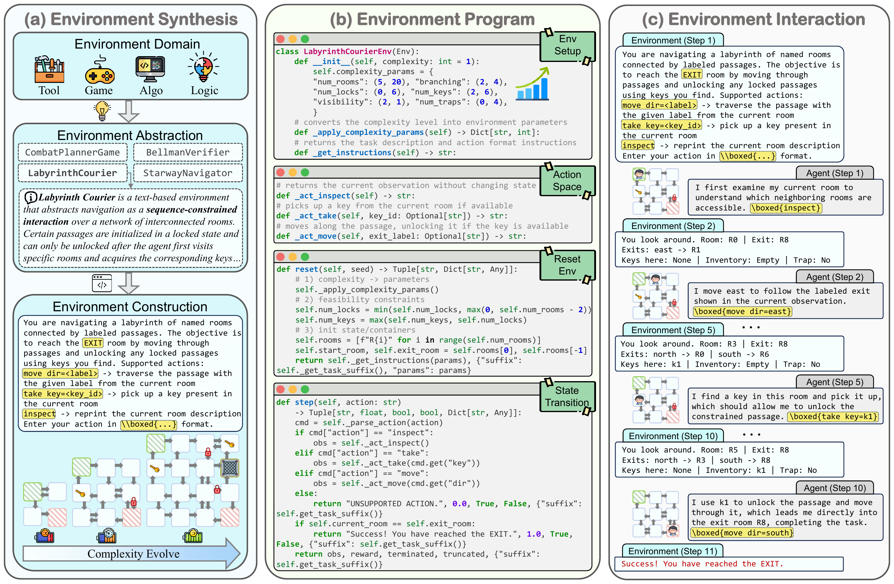

<h1 align="center">
  
  GymVerse: How Far Are We from Fully Automated Environment Scaling for Self-Evolving Agents?
</h1>

<h5 align="center">If you find this project useful, we'd appreciate a star ⭐ on GitHub.</h5>

<p align="center">
  <a href="<PAPER_URL>">Paper</a> |
  <a href="<HF_PAPER_URL>">🤗 Paper</a> |
  <a href="<DATASET_URL>"> 🤗 Dataset</a> |
  <a href="<MODEL_URL>"> 🤗 Model</a> |
  <a href="https://agentic-environmental-engineering.github.io/GymVerse/">Website</a> |
  <a href="https://www.python.org/downloads/release/python-312/">Python 3.10+</a>
</p>

GymVerse is a comprehensive framework for **environment synthesis, evaluation, and agent training** to support the shift
from static data to interaction-driven experience learning. It studies *how far we are from fully automated environment
scaling for self-evolving agents* and provides a practical pipeline for scalable environment engineering.

**What GymVerse provides**

- 🧩 **Environment Synthesis**: Automated synthesis with explicit complexity control, enabling environments to adapt to evolving agents.
- 🧪 **Evaluation**: Principled assessment along correctness, difficulty, and diversity.
- 🧠 **Training**: PERPO (Progressive Environment Relative Policy Optimization) for stable training on evolving environments.

## 📦 Dataset & Models (TODO)

We will release:
- Synthesized environments
- Trained model checkpoints

## 📑 Contents

- [📦 Dataset & Models](#-dataset--models)
- [👀 Overview](#-overview)
- [📊 Results](#-results)
- [📁 Project Structure](#-project-structure)
- [🚀 Quick Start](#-quick-start)
- [🧪 Training](#-training)
- [📈 Evaluation](#-evaluation)
- [📚 Citation](#-citation)
- [📞 Contact](#-contact)

## 👀 Overview

**GymVerse** targets the shift from static data to interaction-driven experience learning, where environments must
be synthesized, evaluated, and iteratively scaled as agent capabilities improve. Our synthesis pipeline is a two-stage
LLM workflow (abstraction → construction) with explicit complexity control.

**Key contributions**
- **Automated environment synthesis** with explicit control over environment complexity.
- **Principled evaluation** of synthesized environments along correctness, difficulty, and diversity.
- **Systematic study** of how environment scale, complexity, correctness, and feedback design affect learning.
- **PERPO**: a simple yet effective RL algorithm for stable training on evolving environments.

<p align="center">
  
  <br>Figure 1. Overview of the automated environment synthesis pipeline. (a) Environment synthesis workflow with complexity control; (b) Key functions defining the synthesized environment program; (c) Interaction loop between the agent and the synthesized environment.
</p>

## 📊 Results

Extensive experiments on GymVerse demonstrate that training on synthesized environments enables effective generalization to unseen environments.
We conduct a systematic study and find that environment properties such as scale, complexity, correctness, and feedback design play a critical role in agent learning.
For more details, please see the complete paper: <a href="<PAPER_URL>">GymVerse</a>.

## 📁 Project Structure

```
GymVerse/
├── Evaluation/                 # Checkpoint evaluation
├── gem/                        # Training/evaluation engine
│   ├── ...                     # Other gem modules
│   ├── examples/train_oat/      # Key training scripts (PERPO, etc.)
│   └── gem/envs/                # Environment implementations
├── fig/                        # Figures used in README
└── README.md
```

## 🚀 Quick Start

### 1. Clone the repository
```bash
git clone <REPO_URL>
cd GymVerse
```

### 2. Install dependencies (GEM)
```bash
cd gem
conda env create -f environment.yml -n oat
conda activate oat

# GPU (CUDA 12.6) + flash-attn
pip install torch==2.6.0 torchvision==0.21.0 torchaudio==2.6.0 --index-url https://download.pytorch.org/whl/cu126
pip install -r requirements.txt
pip install https://github.com/Dao-AILab/flash-attention/releases/download/v2.7.4.post1/flash_attn-2.7.4.post1+cu12torch2.6cxx11abiFALSE-cp310-cp310-linux_x86_64.whl
pip install oat-llm==0.2.4

# install GEM
pip install -e .
```

## 🧪 Training

PERPO (Progressive Environment Relative Policy Optimization) performs environment-level return normalization and progressively evolves environment complexity for stable training.

### PERPO training example (single environment)
```bash
export CUDA_VISIBLE_DEVICES=0,1,2,3
export WANDB_API_KEY=<YOUR_WANDB_KEY>

python examples/train_oat/train_oat_perpo.py \
  --env_id "example:RunicPotionGame" \
  --evolve \
  --prompt_template qwen3_game \
  --wrappers concat \
  --gamma 0.9 \
  --norm_return \
  --gpus 4 \
  --gradient-checkpointing \
  --num_samples 1 \
  --num_env 4 \
  --rollout_batch_size 128 \
  --rollout_batch_size_per_device 16 \
  --pi_buffer_maxlen_per_device 16 \
  --pretrain Qwen/Qwen3-4B-Base \
  --enable_prefix_caching \
  --collocate \
  --vllm_sleep \
  --vllm_gpu_ratio 0.45 \
  --rnd-seed \
  --learning_rate 0.000001 \
  --lr_scheduler constant \
  --lr_warmup_ratio 0 \
  --num_ppo_epochs 2 \
  --train_batch_size 128 \
  --train_batch_size_per_device 1 \
  --beta 0 \
  --max_model_len 30000 \
  --generate_max_length 8192 \
  --temperature 1.0 \
  --top_p 1 \
  --eval_steps -1 \
  --save_steps -1 \
  --eval_temperature 0.6 \
  --eval_top_p 0.95 \
  --eval_generate_max_length 4096 \
  --max_train 9000 \
  --max_save_num 30 \
  --use-wb \
  --wb-run-name "gymverse-perpo-singleenv-RunicPotionGame" \
  --wb_project gymverse-singleenv
```

### PERPO training example (multi-environment)
```bash
export CUDA_VISIBLE_DEVICES=0,1,2,3
export WANDB_API_KEY=<YOUR_WANDB_KEY>

python examples/train_oat/train_oat_perpo.py \
  --env_id "example:RunicPotionGame|example:RaidPartyPlanner|example:RuneRingPuzzle|example:GuildRegionsGame" \
  --evolve \
  --prompt_template qwen3_game \
  --wrappers concat \
  --gamma 0.9 \
  --norm_return \
  --gpus 4 \
  --gradient-checkpointing \
  --num_samples 1 \
  --num_env 4 \
  --rollout_batch_size 128 \
  --rollout_batch_size_per_device 16 \
  --pi_buffer_maxlen_per_device 16 \
  --pretrain Qwen/Qwen3-4B-Base \
  --enable_prefix_caching \
  --collocate \
  --vllm_sleep \
  --vllm_gpu_ratio 0.45 \
  --rnd-seed \
  --learning_rate 0.000001 \
  --lr_scheduler constant \
  --lr_warmup_ratio 0 \
  --num_ppo_epochs 2 \
  --train_batch_size 128 \
  --train_batch_size_per_device 1 \
  --beta 0 \
  --max_model_len 30000 \
  --generate_max_length 8192 \
  --temperature 1.0 \
  --top_p 1 \
  --eval_steps -1 \
  --save_steps -1 \
  --eval_temperature 0.6 \
  --eval_top_p 0.95 \
  --eval_generate_max_length 4096 \
  --max_train 9000 \
  --max_save_num 30 \
  --use-wb \
  --wb-run-name "gymverse-perpo-multienv-4envs" \
  --wb_project gymverse-multienv
```

## 📈 Evaluation

Checkpoint evaluation is provided in `Evaluation/`. See:
- `Evaluation/README.md` for the complete evaluation workflow

## 🧩 Environment Registration

To add your own synthesized environment:

1. Create a new folder under `gem/gem/envs/` (e.g., `gem/gem/envs/yourenv/`) and implement a GEM-compatible environment (standard `reset()` / `step()` interface).
2. Register the environment in `gem/gem/envs/__init__.py`.

After registration, you can use your environment through the usual `env_id` (e.g., `yourenv:YourEnvName` or your chosen prefix), just like the built-in ones.

## 📚 Citation

If you use GymVerse in your research, please cite our paper:

```
[Paper citation placeholder]
```

## 📞 Contact

For any questions or feedback, please reach out to us at <CONTACT_EMAIL>.
